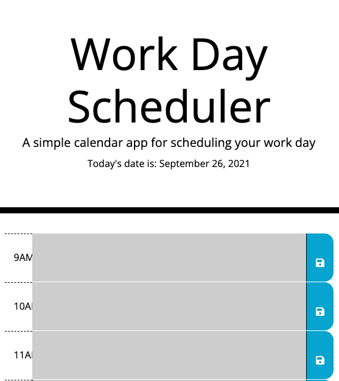

# Work Day Scheduler

This work day scheduler saves to local storage and dynamically updates the colors of event slots based on the time of day. It automatically refreshes every miute.

Languages used:
* Javascript/JQuery
* HTML
* CSS

Deployed Application: https://cassie-s.github.io/day-calendar/

